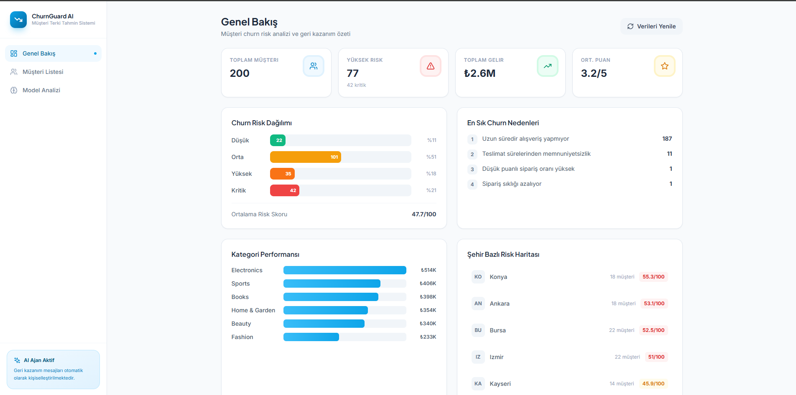
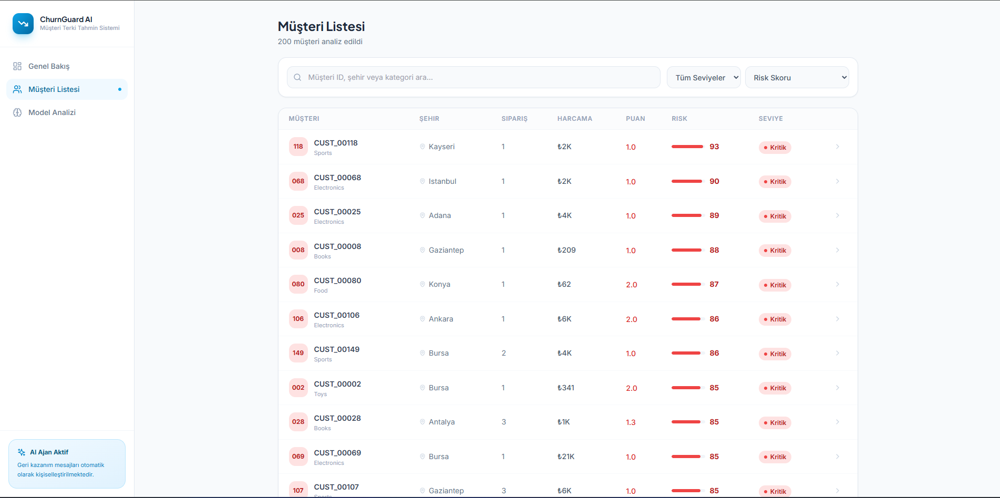
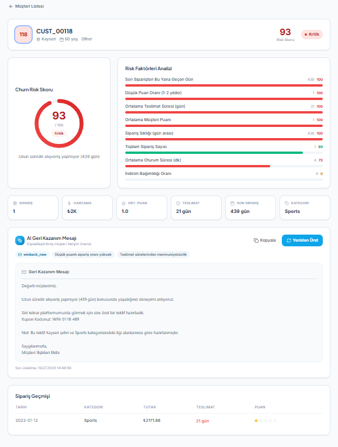
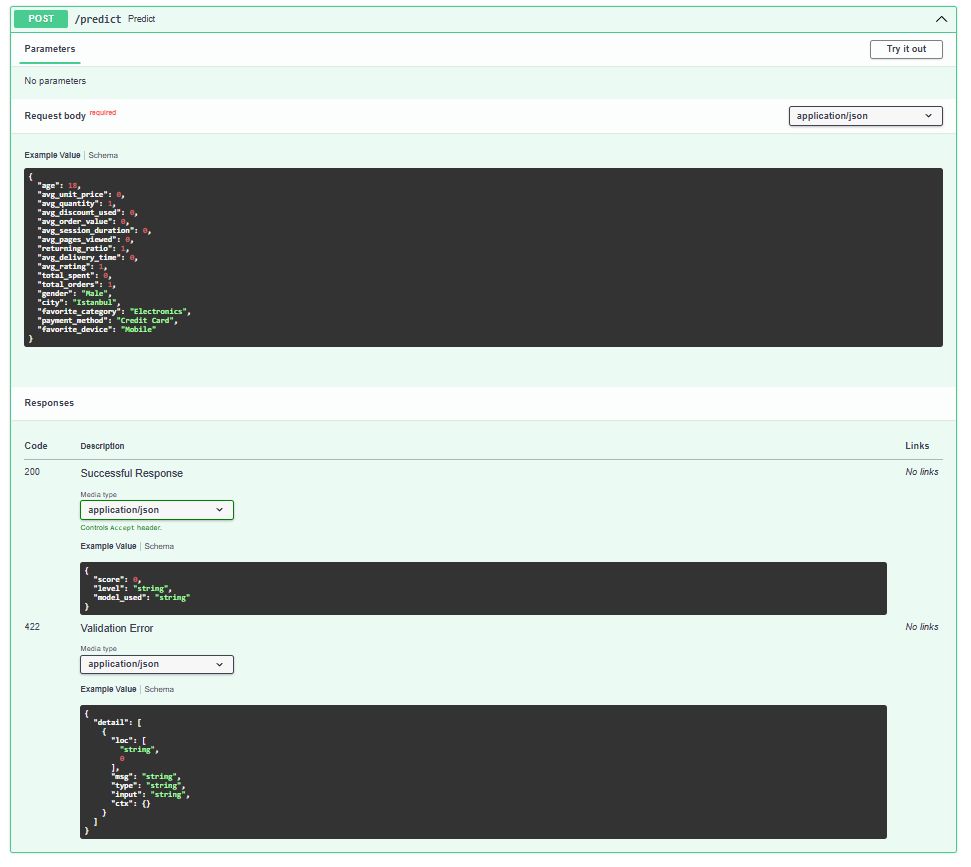
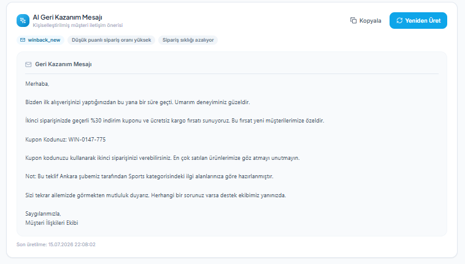
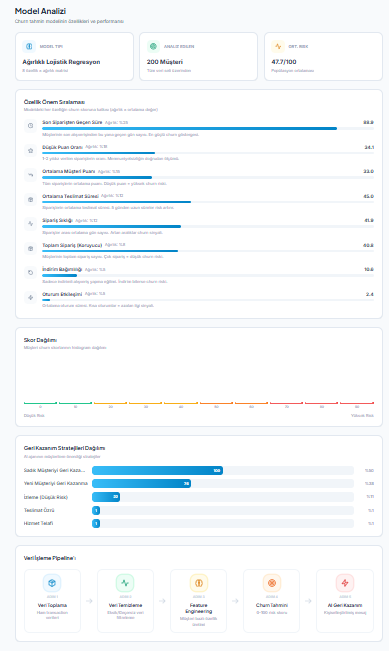

**Takım 45**

---

# Ürün İle İlgili Bilgiler

## Takım Elemanları

| İsim | Görev |
|---|---|
| Taha Yusuf ERTEN | Scrum Master / Full Stack Developer |
| Ceyda BOZTEMİR | Product Owner / Data Scientist |
| Zeynep KARABULUT | Developer |
| Onur GÜNENÇ | Developer |
| Batuhan Şamil Şen | Developer |

---

## Ürün İsmi
**E-Commerce Churn Guard**

## Ürün Açıklaması
E-Commerce Churn Guard, Türkiye'deki e-ticaret müşterilerinin platform terk (churn) riskini makine öğrenmesi ile tahmin eden ve riskli müşterilere otomatik olarak kişiselleştirilmiş Türkçe geri kazanım mesajı üreten bir CRM / karar destek panelidir.

Sistem; müşteri işlem geçmişini analiz ederek RFM tabanlı özellikler çıkarır, eğitilmiş bir Random Forest modeli ile churn olasılığını hesaplar ve Gemini LLM aracılığıyla her müşteriye özel, kurumsal ama samimi tonlu e-posta taslakları oluşturur.

## Ürün Özellikleri
- Gerçek zamanlı churn riski skorlaması (Düşük / Orta / Yüksek / Kritik)
- Random Forest modeli ile %80+ doğruluk oranı
- Gemini API ile kişiselleştirilmiş Türkçe geri kazanım mesajı üretimi
- RFM tabanlı özellik mühendisliği (recency, frequency, monetary)
- Müşteri bazlı detaylı analiz paneli
- Risk seviyesine göre otomatik strateji atama
- Supabase üzerinde gerçek zamanlı veri senkronizasyonu
- FastAPI backend ile modüler ve genişletilebilir mimari

## Hedef Kitle
- E-ticaret şirketlerinin CRM ve müşteri ilişkileri ekipleri
- Müşteriyi elde tutma (retention) stratejisi geliştiren pazarlama yöneticileri
- Veri odaklı karar destek aracı arayan küçük-orta ölçekli e-ticaret platformları
- Türkiye'deki dijital perakende sektörü çalışanları

## Product Backlog

Görev takibi ve sprint planlaması **WhatsApp grup yazışması** üzerinden yürütüldü. Ekip üyeleri yapılacak görevleri, öncelikleri ve sorumlulukları WhatsApp üzerinden paylaştı ve güncelledi.

---

---

# Sprint 1

**Sprint Tarihleri:** 18 Haziran – 4 Temmuz 2025  
**Sprint Hedefi:** Proje altyapısının kurulması, veri pipeline'ının oluşturulması ve temel UI bileşenlerinin hazırlanması.

---

**Sprint Notları:**
- Proje React + Vite + TypeScript + Tailwind + Supabase üzerine kurgulandı.
- Orijinal planda FastAPI + Streamlit düşünülmüştü; ekip kararıyla React tabanlı SPA mimarisine geçildi.
- Ceyda, Random Forest modelini bağımsız olarak eğitti; bu sprint'te veri tarafı hazırlandı.
- Supabase şeması `customer_features` ve `transactions` tabloları ile belirlendi.

---

**Sprint İçinde Tamamlanması Tahmin Edilen Puan:** `80 Puan`

**Puan Tamamlama Mantığı:**

Toplam proje puanı **240** olarak planlandı ve 3 sprint'e eşit dağıtıldı (her sprint 80 puan). Görevlere zorluk ve iş yüküne göre puan verildi:

| Görev | Puan | Durum |
|---|---|---|
| Proje kurulumu, Vite + Tailwind + TS yapılandırması | 5 | ✅ Tamamlandı |
| Supabase şema tasarımı ve migration dosyaları | 10 | ✅ Tamamlandı |
| `cleanTransactions` veri temizleme modülü | 10 | ✅ Tamamlandı |
| `engineerFeatures` özellik mühendisliği | 15 | ✅ Tamamlandı |
| Heuristic churn skorlama algoritması (`predictChurn`) | 15 | ✅ Tamamlandı |
| Dashboard UI bileşeni | 10 | ✅ Tamamlandı |
| CustomerList UI bileşeni | 8 | ✅ Tamamlandı |
| CustomerDetail UI bileşeni | 5 | ✅ Tamamlandı |
| DataSeeder (Supabase'e rastgele veri doldurma) | 2 | ✅ Tamamlandı |
| **Toplam** | **80** | **80 / 80 ✅** |

---

**Daily Scrum:**

Günlük iletişim **WhatsApp** grup yazışması üzerinden yürütüldü. Ekip üyeleri her gün yapılan işleri, planları ve engelleri grup üzerinden paylaştı. Teknik konularda anlık çağrı ihtiyacı doğduğunda Google Meet kullanıldı.

---

**Sprint Board Güncelleme:**

Görev takibi WhatsApp üzerinden yürütüldüğünden ayrı bir board aracı kullanılmadı. Sprint boyunca tamamlanan görevler yukarıdaki tabloda listelenmiştir.

---

**Ürün Durumu:**

Sprint 1 sonunda aşağıdaki ekranlar çalışır hâle getirildi:

*Ana dashboard — müşteri risk dağılımı, özet metrikler*

*Müşteri listesi — risk seviyesine göre filtreleme*

*Müşteri detay sayfası — churn faktörleri ve skor*

---

**Sprint Review:**

Sprint 1'de projenin temel iskeleti tamamlandı. Veri pipeline'ı (temizleme → özellik mühendisliği → heuristic skorlama) çalışır duruma getirildi. Supabase şeması tasarlandı ve migration'lar yazıldı. Tüm temel UI bileşenleri (Dashboard, CustomerList, CustomerDetail) hayata geçirildi. Gemini entegrasyonu ve gerçek ML modeli bir sonraki sprint'e bırakıldı.

**Sprint Review Katılımcıları:** Taha Yusuf ERTEN, Ceyda BOZTEMİR, Zeynep KARABULUT, Onur GÜNENÇ, Batuhan Şamil Şen

---

**Sprint Retrospective:**

- ✅ Mimari kararlar (React SPA) erkenden netleştirildi, sonraki sprint'lerde değişiklik maliyeti düştü.
- ✅ Supabase şemasının baştan doğru tasarlanması ilerideki entegrasyonları kolaylaştırdı.
- ⚠️ Heuristic skorlama geçici çözüm olarak kaldı; Sprint 2'de gerçek ML modeli ile değiştirilmesi öncelik olacak.
- ⚠️ Görev dağılımında başlangıçta belirsizlik yaşandı; Sprint 2'den itibaren her görev başlamadan önce WhatsApp'ta netleştirilerek atanacak.
- 📌 Sprint 2 için: FastAPI backend + `churn_modeli.pkl` entegrasyonu ve Gemini API bağlantısı hedeflendi.

---

---

# Sprint 2

**Sprint Tarihleri:** 5 Temmuz – 18 Temmuz 2025  
**Sprint Hedefi:** Ceyda'nın eğittiği Random Forest modelini backend'e entegre etmek, Gemini API ile gerçek LLM mesaj üretimini aktif hâle getirmek.

---

**Sprint Notları:**
- FastAPI backend `backend/` klasörü altında sıfırdan kuruldu.
- `churn_modeli.pkl` modeli 36 özellik ile çalışıyor; Türkçe sütun isimleri ve one-hot encoding içeriyor.
- Python 3.14 ile `scikit-learn 1.5.2` uyumsuzluğu tespit edildi; `scikit-learn>=1.6.0`'a geçildi.
- Gemini `gemini-2.0-flash` modeli kullanıldı; API ulaşılamazsa şablon tabanlı fallback devreye giriyor.
- `recoveryAgent.ts` artık `async` fonksiyon; `useChurnData.ts` buna göre güncellendi.
- `dataSeeder.ts` Gemini'yi çağırmak yerine fallback şablonu kullanıyor (toplu seed işlemi için gereksiz API çağrısı önlendi).

---

**Sprint İçinde Tamamlanması Tahmin Edilen Puan:** `80 Puan`

**Puan Tamamlama Mantığı:**

| Görev | Puan | Durum |
|---|---|---|
| FastAPI backend kurulumu + CORS yapılandırması | 10 | ✅ Tamamlandı |
| `churn_modeli.pkl` yükleme ve `/predict` endpoint | 20 | ✅ Tamamlandı |
| 36-feature mapping ve one-hot encoding (backend) | 10 | ✅ Tamamlandı |
| Frontend `predictChurnWithModel` → FastAPI entegrasyonu | 10 | ✅ Tamamlandı |
| Gemini API entegrasyonu (`recoveryAgent.ts`) | 15 | ✅ Tamamlandı |
| Fallback mekanizması (Gemini → şablon) | 5 | ✅ Tamamlandı |
| `async` uyumluluğu ve TypeScript düzeltmeleri | 5 | ✅ Tamamlandı |
| Python 3.14 uyumluluğu (`requirements.txt` güncelleme) | 5 | ✅ Tamamlandı |
| **Toplam** | **80** | **80 / 80 ✅** |

---

**Daily Scrum:**

Sprint 2'de de günlük iletişim **WhatsApp** grup yazışması üzerinden sürdürüldü. Backend kurulum sürecinde ve Gemini entegrasyonundaki hata ayıklama aşamalarında Google Meet'e geçildi.

---

**Sprint Board Güncelleme:**

Görev takibi WhatsApp üzerinden yürütüldüğünden ayrı bir board aracı kullanılmadı. Sprint boyunca tamamlanan görevler yukarıdaki tabloda listelenmiştir.

---

**Ürün Durumu:**

Sprint 2 sonunda sistem uçtan uca çalışır hâle geldi:

*FastAPI `/predict` endpoint — gerçek model çıktısı (score, level, model_used)*

*Müşteri detay sayfasında Gemini tarafından üretilen kişiselleştirilmiş Türkçe mesaj*

*Gerçek ML modeli skorları ile güncellenen risk dağılım grafiği*

---

**Sprint Review:**

Sprint 2'de projenin makine öğrenmesi ve yapay zeka katmanları tamamlandı. FastAPI backend `http://localhost:8001` üzerinde çalışır hâle getirildi. Ceyda'nın eğittiği 36-feature Random Forest modeli sisteme entegre edildi. Gemini `gemini-2.0-flash` API'si ile kişiselleştirilmiş Türkçe geri kazanım mesajları üretilmeye başlandı. Tüm bileşenler (model, LLM, Supabase, React UI) uçtan uca birbirine bağlandı.

**Sprint Review Katılımcıları:** Taha Yusuf ERTEN, Ceyda BOZTEMİR, Zeynep KARABULUT, Onur GÜNENÇ, Batuhan Şamil Şen

---

**Sprint Retrospective:**

- ✅ Model entegrasyonu planlandığından hızlı ilerledi; Ceyda'nın önceden hazırladığı `.pkl` dosyası süreci hızlandırdı.
- ✅ Fallback mekanizması (Gemini → şablon) doğru bir karar oldu; API key yokken bile sistem çalışmaya devam ediyor.
- ⚠️ scikit-learn versiyon uyumsuzluğu (1.5.2 vs 1.9.0) beklenmedik zaman kaybına yol açtı; bir sonraki projede model ile birlikte `requirements.txt` paylaşılacak.
- ⚠️ Port 8000 Windows'ta kilitleniyor; geliştirme ortamında port yönetimi için bir standart belirlenmeli.
- 📌 Sprint 3 için: UI/UX iyileştirmeleri, model doğruluk metrikleri ekranı, deployment (Render / Railway backend, Vercel frontend) ve kullanıcı testleri planlanıyor.

---

---

## Kullanılan Teknolojiler

**Frontend**
- React 18
- Vite
- TypeScript
- Tailwind CSS
- lucide-react

**Backend**
- Python 3.14
- FastAPI
- scikit-learn
- NumPy
- Pydantic

**Veritabanı**
- Supabase (PostgreSQL)
- @supabase/supabase-js

**Yapay Zeka**
- Google Gemini API (`gemini-2.0-flash`)
- scikit-learn Random Forest Classifier

---

*Bu README Yapay Zeka ve Teknoloji Akademisi Bootcamp 2026 — Takım 45 tarafından hazırlanmıştır.*
